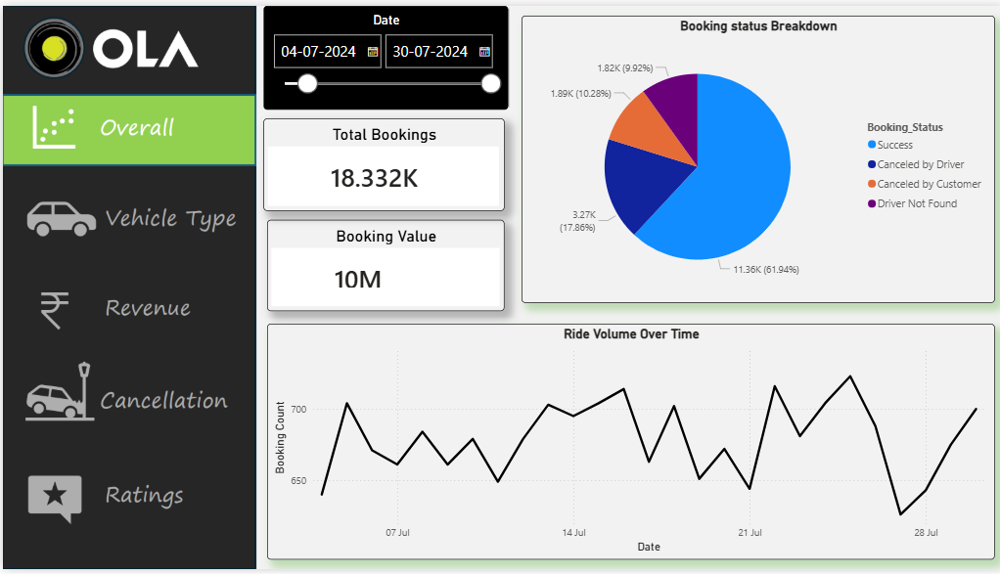
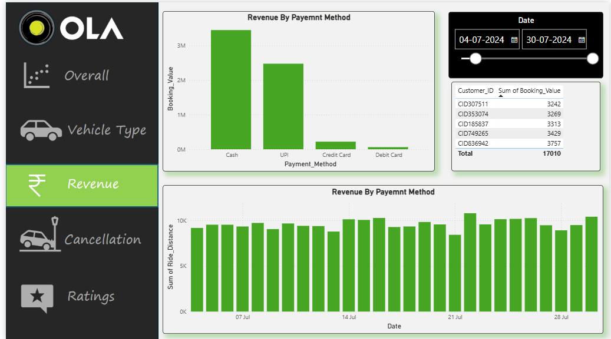
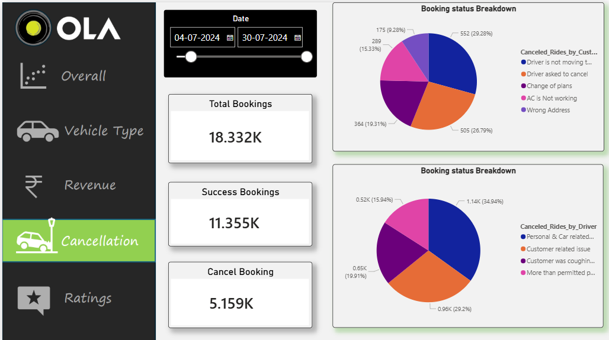
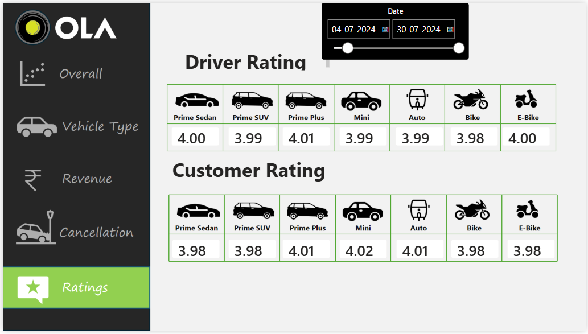

# 🚖 Ola Dashboard Analysis

## 📌 Project Overview
This project focuses on analyzing Ola ride data using **Power BI**, **Excel Data Cleaning**, and **SQL Analysis**. The dashboard provides key business insights related to bookings, revenue, ride status, customer behavior, and operational performance.

## 📸 Dashboard Screenshots

### Dashboard View 1

### Dashboard View 2

### Dashboard View 3

### Dashboard View 4

### Dashboard View 5

## 🎯 Objectives
- Clean and preprocess raw ride data.
- Perform data analysis using SQL.
- Create interactive Power BI dashboards.
- Generate actionable business insights for decision-making.

## 🛠️ Tools & Technologies
- Power BI
- Microsoft Excel
- SQL
- Data Visualization
- Data Cleaning

## 📂 Project Files
- `ola.pbix` → Power BI Dashboard File
- `ola sheet - Sheet1.csv` → Dataset
- `slide1.png` → Dashboard Screenshot 1
- `slide2.png` → Dashboard Screenshot 2
- `slide3.png` → Dashboard Screenshot 3
- `slide4.png` → Dashboard Screenshot 4
- `slide5.png` → Dashboard Screenshot 5

## 📊 Dashboard Insights
### 1. Booking Analysis
- Total bookings made.
- Successful and cancelled rides.
- Ride trends over time.

### 2. Revenue Analysis
- Total revenue generated.
- Revenue distribution by ride category.
- Average booking value.

### 3. Customer Analysis
- Active customers.
- Customer booking patterns.
- Customer retention insights.

### 4. Ride Performance
- Ride completion rate.
- Cancellation reasons.
- Peak booking periods.

### 5. Operational Metrics
- Driver performance.
- Ride demand analysis.
- Service efficiency tracking.

## 🚀 Key Outcomes
- Improved understanding of customer behavior.
- Identified booking and revenue trends.
- Evaluated ride cancellation patterns.
- Created an interactive dashboard for business insights.

## 👨‍💻 Author
**Sidharth Sharma**

LinkedIn: Add Your LinkedIn Profile Here

GitHub: https://github.com/sidharthhcj

---
⭐ If you found this project useful, feel free to star the repository.
